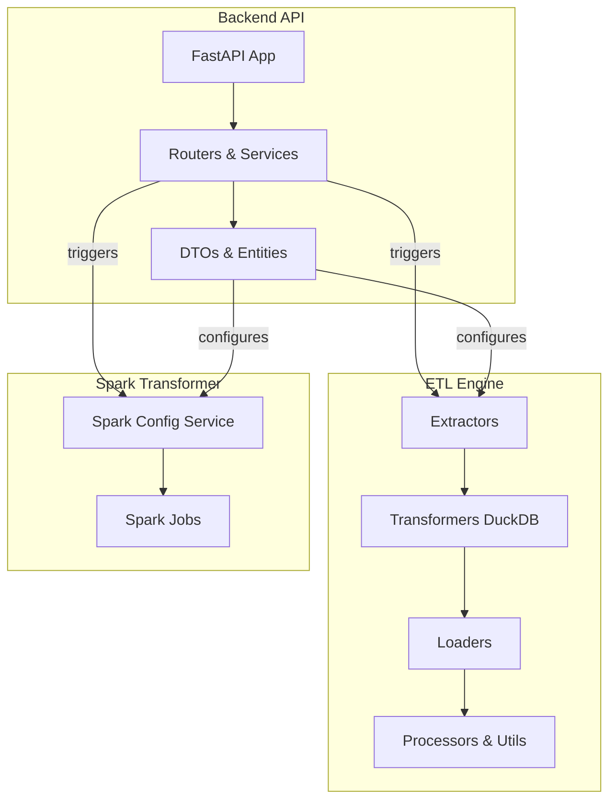

# Data Platform ETL Service

[](LICENSE)
[](https://github.com/your-repo/actions)
[](https://codecov.io/gh/your-repo)

A robust and scalable ETL (Extract, Transform, Load) service designed to handle data pipelines efficiently. This service supports multiple data sources, transformations, and destinations, making it ideal for modern data platforms.

---

## Table of Contents

- [Features](#features)
- [Getting Started](#getting-started)
  - [Prerequisites](#prerequisites)
  - [Installation](#installation)
  - [Configuration](#configuration)
- [Usage](#usage)
- [API Documentation](#api-documentation)
- [Contributing](#contributing)
- [License](#license)

---

## Architecture



## Features

- **Multi-source Extraction**: Supports MongoDB, Postgres, SQL Server, AWS, GCP, and more.
- **Flexible Transformations**: Leverages Spark for scalable data processing.
- **Multi-destination Loading**: Load data into ClickHouse, Postgres, HuggingFace, and more.
- **FastAPI Integration**: Provides a RESTful API for managing pipelines.
- **Extensible Design**: Easily add new extractors, transformers, or loaders.

---

## Getting Started

### Prerequisites

- Python 3.8 or higher
- Docker (optional, for containerized deployment)
- pip or poetry for dependency management

### Installation

1. Clone the repository:

   ```bash
   git clone https://github.com/your-repo/data-platform-etl-service.git
   cd data-platform-etl-service
   ```

2. Install dependencies:

   ```bash
   pip install -r requirements.txt
   ```

3. Set up environment variables:
   ```bash
   cp .env.example .env
   ```

### Configuration

Edit the `.env` file to configure database connections, API keys, and other settings.

---

## Usage

### Running the Service

To start the service locally:

```bash
python server.py
```

For hot-reloading during development:

```bash
uvicorn server:app --reload
```

### Running with Docker

1. Build the Docker image:

   ```bash
   docker build -t data-platform-etl-service .
   ```

2. Run the container:
   ```bash
   docker run -p 8000:8000 --env-file .env data-platform-etl-service
   ```

---

## API Documentation

The API documentation is automatically generated using FastAPI. Once the service is running, you can access it at:

- Swagger UI: [http://localhost:8000/docs](http://localhost:8000/docs)
- ReDoc: [http://localhost:8000/redoc](http://localhost:8000/redoc)

---

## Contributing

We welcome contributions! To get started:

1. Fork the repository.
2. Create a new branch for your feature or bugfix:
   ```bash
   git checkout -b feature-name
   ```
3. Commit your changes:
   ```bash
   git commit -m "Add new feature"
   ```
4. Push to your fork and submit a pull request.

Please ensure your code follows the project's coding standards and includes tests where applicable.

---

## Roadmap

- [x] implement ETL engine, support both copy file and arrow table mode, transform with `duckdb`. Support fully JSON configuration
- [x] implement example for creating factory of ETL engine, by api interfaces.
- [x] testing ETL engine
- [-] implement `sql server ext` and `clickhouse loader`
- [x] refactor spark transformer engine (this is standalone engine, not part of ETL engine only support large transform on s3 storage)
- [ ] generate documentation (leverage ai tools read codebase)
- [ ] generate postman collection (leverage ai tools read codebase)

## License

This project is licensed under the MIT License. See the [LICENSE](LICENSE) file for details.

---

## Acknowledgments

- [FastAPI](https://fastapi.tiangolo.com/) for the API framework.
- [Apache Spark](https://spark.apache.org/) for data transformations.
- [ClickHouse](https://clickhouse.com/) for analytics database support.

---

## Contact

For questions or support, please open an issue or contact [your-email@example.com](mailto:your-email@example.com).
